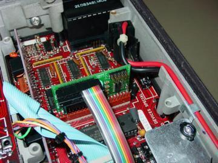
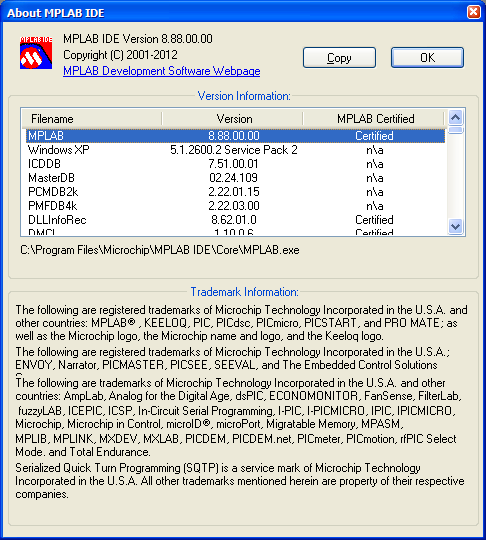

# Xcat Firmware

https://github.com/skiphansen/xcat_fw

## What is this?

The Xcat was a PIC based device that replaced the Motorola Syntor X radios
"code plug" to provide frequency agility for Ham radio operators.

For more information about Xcats visit the Xcat group on [groups.io](https://groups.io/g/xcat)

The project consists of
- [Xcat PC control program](https://github.com/skiphansen/xcat_fw)
- [Xcat firmware](https://github.com/skiphansen/xcat_ldr)
- [Xcat booloader](https://github.com/skiphansen/xcat_ldr)

This the firmware for the Xcat Syntor X code plug replacement project.

This program was originally written in 2004 and hasn't been touched since 
Feb 2010. 

I've put this on github as a history preservation project.

The Sytnor X was OLD in 2004 when this project was started and 18 years later
they are STILL working! In fact I'm listening to 445.42 on my Syntor X base as 
I write this file.

I **WISH** PCs lasted a bit longer, NONE of my PCs from 2004 still work.

## Building

1. Install MPLab version 8.88.00.00 (2012).  

Newer versions may be able to convert the project, I don't know.  I haven't done 
any PIC programming for years.

2. Clone this repository.

3. Start MPLAB and open the xcat project xcat.mcp.

4. Select "Build All" from the Build menu

